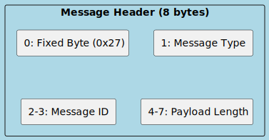
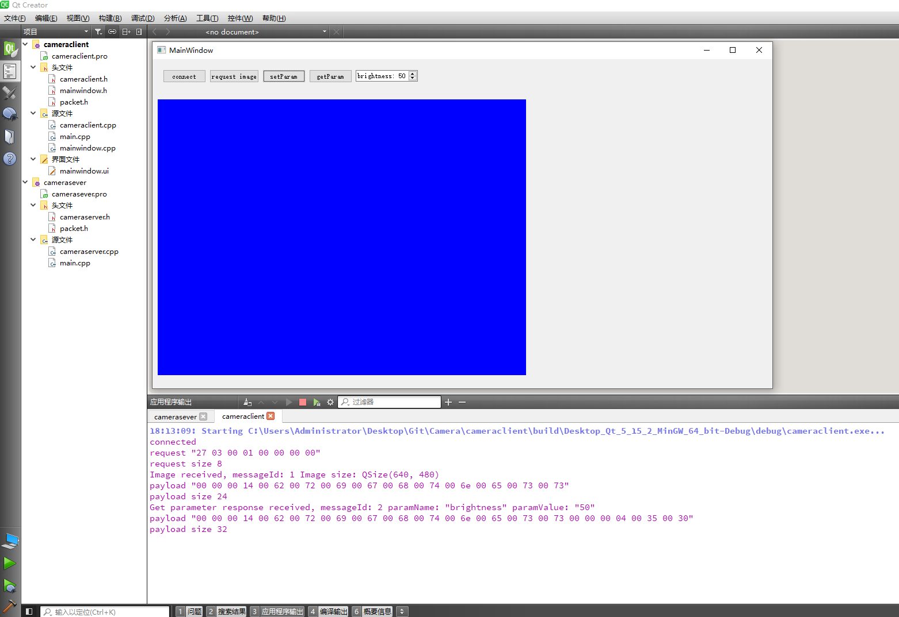

# Thinking in Qt

经营淘宝店 cuteqt.taobao.com 一年有余，看过很多同学的 Qt 代码，有一些想法，想记录一下。

第一篇想讲一下 Qt 程序的架构

一般的，在数据处理流程中，通常会经历以下几个步骤：

1. 数据协议解析（如以太网、串口、Wi-Fi、蓝牙、USB、CAN等）
2. 后处理（如数据清洗、过滤和转换、数据聚合、数据压缩、加密和解密、特征提取、信号处理、图像处理、视频处理、统计分析、模式识别、自然语言处理和时间序列分析等）
3. 界面渲染。

界面渲染通常在主线程上进行，而数据解析和后处理则在各自独立的线程中运行。


接下来，讲一下 Qt 如何创建多线程

让我们回顾下 Qt 文档中的示例代码

第一种是继承 QThread

```cpp
class WorkerThread : public QThread
{
    Q_OBJECT
    void run() override {
        QString result;
        /* ... here is the expensive or blocking operation ... */
        emit resultReady(result);
    }
signals:
    void resultReady(const QString &s);
};
void MyObject::startWorkInAThread()
{
    WorkerThread *workerThread = new WorkerThread(this);
    connect(workerThread, &WorkerThread::resultReady, this, &MyObject::handleResults);
    connect(workerThread, &WorkerThread::finished, workerThread, &QObject::deleteLater);
    workerThread->start();
}
```

第二种是 moveToThread

```cpp
class Worker : public QObject
{
    Q_OBJECT
public slots:
    void doWork(const QString &parameter) {
        QString result;
        /* ... here is the expensive or blocking operation ... */
        emit resultReady(result);
    }
signals:
    void resultReady(const QString &result);
};
class Controller : public QObject
{
    Q_OBJECT
    QThread workerThread;
public:
    Controller() {
        Worker *worker = new Worker;
        worker->moveToThread(&workerThread);
        connect(&workerThread, &QThread::finished, worker, &QObject::deleteLater);
        connect(this, &Controller::operate, worker, &Worker::doWork);
        connect(worker, &Worker::resultReady, this, &Controller::handleResults);
        workerThread.start();
    }
    ~Controller() {
        workerThread.quit();
        workerThread.wait();
    }
public slots:
    void handleResults(const QString &);
signals:
    void operate(const QString &);
};
```

两种写法都有各自应用的场景

第一种写法的应用场景：你只想在子线程里做一件简单的事时。比如不停地接收串口的数据或者创建一个二进制文件。

第二种写法的应用场景：你想异步操作一个硬件，不阻塞 UI。比如调用摄像头 SDK 的各种 API。

一般来说，第二种场景更常见一些，而且第一种场景也可以用第二种写法改写。

这里为了演示，我选了一个我熟悉的场景，相机的使用。

相机作为 Server 接收 PC 上 Client 的 TCP 消息，可以被修改相机参数，也可以主动发送图像数据

为了简化，我们直接用 QTcpServer 写个软件，模拟相机硬件，然后再用 QTcpSocket 写个 PC 客户端软件，控制相机。

然后我们基于 Tcp 设计一个简单的自定义通信协议



这是消息头的定义：

第 1 字节为固定值 0x27

第 2 字节为消息类型，0x01 表示 **设置参数** 0x02 代表 **获取参数** 0x03 代表 **获取图像**

第 3 4 两字节为消息 ID，从 0 开始单调递增

第 5 6 7 8 四字节为后面要接收的消息体（也称为负载，即 Payload）的长度


> 下面的代码已经上传到 github https://github.com/abc881858/Camera

**Server 端代码如下**

```cpp
//camerasever.pro
QT += core gui network
CONFIG += c++17 cmdline
SOURCES += cameraserver.cpp main.cpp
HEADERS += cameraserver.h packet.h
```

```cpp
//packet.h
#pragma once

#include <QObject>

enum MessageType {
    SET_PARAM = 0x01,
    GET_PARAM = 0x02,
    GET_IMAGE = 0x03
};

struct PacketHeader {
    quint8 fixedByte{0};
    quint8 messageType{0};
    quint16 messageId{0};
    quint32 payloadLength{0};
};
```

```cpp
//main.cpp
#include <QCoreApplication>
#include "cameraserver.h"

int main(int argc, char *argv[]) {
    QCoreApplication a(argc, argv);
    CameraServer server;
    server.listen(QHostAddress::AnyIPv4, 27000);
    return a.exec();
}
```

```cpp
//cameraserver.h
#pragma once

#include <QBuffer>
#include <QDataStream>
#include <QDebug>
#include <QImage>
#include <QMap>
#include <QTcpServer>
#include <QTcpSocket>
#include "packet.h"

class CameraServer : public QTcpServer {
    Q_OBJECT
public:
    CameraServer(QObject *parent = nullptr);
    void sendParam(const QString &paramName);
    void sendImage();
protected:
    void incomingConnection(qintptr socketDescriptor) override;
private:
    QTcpSocket *m_socket;
    QByteArray m_buffer;
    quint16 m_message_id{0};
    PacketHeader m_header;
    bool m_reading_header{true};
    QMap<QString, QString> parameters;
private slots:
    void readClient();
    void discardClient();
    void setParam(const QString &paramName, const QString &paramValue);
};
```

```cpp
//cameraserver.cpp
#include "cameraserver.h"

CameraServer::CameraServer(QObject *parent) : QTcpServer(parent), m_socket(nullptr) {
    parameters["brightness"] = "50";
    parameters["contrast"] = "50";
}

void CameraServer::incomingConnection(qintptr socketDescriptor) {
    if (m_socket) {
        m_socket->disconnectFromHost();
    }
    m_socket = new QTcpSocket(this);
    m_socket->setSocketDescriptor(socketDescriptor);
    connect(m_socket, &QTcpSocket::readyRead, this, &CameraServer::readClient);
    connect(m_socket, &QTcpSocket::disconnected, this, &CameraServer::discardClient);
}

void CameraServer::readClient() {
    m_buffer.append(m_socket->readAll());
    if (m_reading_header && m_buffer.size() >= 8) {
        QDataStream headerStream(m_buffer);
        headerStream.setByteOrder(QDataStream::BigEndian);
        headerStream >> m_header.fixedByte;
        if (m_header.fixedByte != 0x27) {
            qDebug() << "Invalid fixed byte:" << m_header.fixedByte;
            return;
        }
        headerStream >> m_header.messageType;
        headerStream >> m_header.messageId;
        headerStream >> m_header.payloadLength;
        m_reading_header = false;
        m_buffer.remove(0, 8);
    }

    if (!m_reading_header && m_buffer.size() >= int(m_header.payloadLength)) {
        QByteArray payload = m_buffer.left(m_header.payloadLength);
        m_buffer.remove(0, m_header.payloadLength);
        QDataStream payloadStream(payload);
        payloadStream.setByteOrder(QDataStream::BigEndian);
        switch (m_header.messageType) {
        case SET_PARAM: {
            QString paramName;
            QString paramValue;
            payloadStream >> paramName >> paramValue;
            setParam(paramName, paramValue);
            break;
        }
        case GET_PARAM: {
            QString paramName;
            payloadStream >> paramName;
            sendParam(paramName);
            break;
        }
        case GET_IMAGE: {
            sendImage();
            break;
        }
        default:
            qDebug() << "Unknown message type:" << m_header.messageType;
        }
        m_header.fixedByte = 0;
        m_header.messageType = 0;
        m_header.messageId = 0;
        m_header.payloadLength = 0;
        m_reading_header = true;
    }
}

void CameraServer::discardClient() {
    m_socket->deleteLater();
    m_socket = nullptr;
}

void CameraServer::setParam(const QString &paramName, const QString &paramValue) {
    parameters[paramName] = paramValue;
}

void CameraServer::sendParam(const QString &paramName) {
    if (!m_socket) return;
    QString paramValue = parameters.value(paramName, "unknown");
    QByteArray payload;
    QDataStream tmp(&payload, QIODevice::WriteOnly);
    tmp.setByteOrder(QDataStream::BigEndian);
    tmp << paramName << paramValue;
    QByteArray response;
    QDataStream stream(&response, QIODevice::WriteOnly);
    stream.setByteOrder(QDataStream::BigEndian);
    stream << quint8(0x27) << quint8(0x02) << quint16(++m_message_id) << quint32(payload.size());
    m_socket->write(response);
    m_socket->write(payload);
    m_socket->flush();
}

void CameraServer::sendImage() {
    if (!m_socket) return;
    QImage image(640, 480, QImage::Format_RGB32);
    image.fill(Qt::blue);
    QByteArray payload;
    QBuffer buffer(&payload);
    image.save(&buffer, "PNG");
    QByteArray response;
    QDataStream stream(&response, QIODevice::WriteOnly);
    stream.setByteOrder(QDataStream::BigEndian);
    stream << quint8(0x27) << quint8(0x03) << quint16(++m_message_id) << quint32(payload.size());
    m_socket->write(response);
    m_socket->write(payload);
    m_socket->flush();
}
```

**Client 端代码如下**

【cameraclient.pro】

```cpp
QT += core gui widgets network

CONFIG += c++17

SOURCES += \
    cameraclient.cpp \
    main.cpp \
    mainwindow.cpp

HEADERS += \
    cameraclient.h \
    mainwindow.h \
    packet.h

FORMS += \
    mainwindow.ui
```

【packet.h】

```cpp
#pragma once

#include <QObject>

enum MessageType {
    SET_PARAM = 0x01,
    GET_PARAM = 0x02,
    GET_IMAGE = 0x03
};

struct PacketHeader {
    quint8 fixedByte{0};
    quint8 messageType{0};
    quint16 messageId{0};
    quint32 payloadLength{0};
};
```

【main.cpp】

```cpp
#include "mainwindow.h"
#include <QApplication>

int main(int argc, char *argv[]) {
    QApplication a(argc, argv);
    MainWindow w;
    w.show();
    return a.exec();
}
```

【mainwindow.h】

```cpp
#pragma once

#include <QMainWindow>
#include "cameraclient.h"

QT_BEGIN_NAMESPACE
namespace Ui { class MainWindow; }
QT_END_NAMESPACE

class MainWindow : public QMainWindow {
    Q_OBJECT
public:
    MainWindow(QWidget *parent = nullptr);
    ~MainWindow();
private:
    Ui::MainWindow *ui;
    CameraClient *m_camera_client;
public slots:
    void send_image(QImage image);
    void brightness_slot(QString str);
private slots:
    void on_pushButton_clicked();
    void on_pushButton_2_clicked();
    void on_pushButton_3_clicked();
    void on_pushButton_4_clicked();
};
```

【mainwindow.cpp】

```cpp
#include "mainwindow.h"
#include "ui_mainwindow.h"

MainWindow::MainWindow(QWidget *parent) : QMainWindow(parent), ui(new Ui::MainWindow) {
    ui->setupUi(this);
    m_camera_client = new CameraClient;
    connect(m_camera_client, &CameraClient::send_image, this, &MainWindow::send_image);
    connect(m_camera_client, &CameraClient::brightness_signal, this, &MainWindow::brightness_slot);
}

MainWindow::~MainWindow() {
    delete ui;
}

void MainWindow::on_pushButton_clicked() {
    m_camera_client->connectToServer("127.0.0.1", 27000);
}

void MainWindow::on_pushButton_2_clicked() {
    m_camera_client->requestImage();
}

void MainWindow::on_pushButton_3_clicked() {
    m_camera_client->setParam("brightness", QString::number(ui->spinBox->value()));
}

void MainWindow::on_pushButton_4_clicked() {
    m_camera_client->getParam("brightness");
}

void MainWindow::send_image(QImage image) {
    ui->label->setPixmap(QPixmap::fromImage(image));
}

void MainWindow::brightness_slot(QString str) {
    ui->spinBox->setValue(str.toInt());
}
```

【mainwindow.ui】

```xml
<?xml version="1.0" encoding="UTF-8"?>
<ui version="4.0">
 <class>MainWindow</class>
 <widget class="QMainWindow" name="MainWindow">
  <property name="geometry">
   <rect>
    <x>0</x>
    <y>0</y>
    <width>800</width>
    <height>600</height>
   </rect>
  </property>
  <property name="windowTitle">
   <string>MainWindow</string>
  </property>
  <widget class="QWidget" name="centralwidget">
   <layout class="QVBoxLayout" name="verticalLayout">
    <item>
     <widget class="QWidget" name="widget" native="true">
      <property name="sizePolicy">
       <sizepolicy hsizetype="Preferred" vsizetype="Fixed">
        <horstretch>0</horstretch>
        <verstretch>0</verstretch>
       </sizepolicy>
      </property>
      <layout class="QHBoxLayout" name="horizontalLayout">
       <item>
        <widget class="QPushButton" name="pushButton">
         <property name="text">
          <string>connect</string>
         </property>
        </widget>
       </item>
       <item>
        <widget class="QPushButton" name="pushButton_2">
         <property name="text">
          <string>request image</string>
         </property>
        </widget>
       </item>
       <item>
        <widget class="QPushButton" name="pushButton_3">
         <property name="text">
          <string>setParam</string>
         </property>
        </widget>
       </item>
       <item>
        <widget class="QPushButton" name="pushButton_4">
         <property name="text">
          <string>getParam</string>
         </property>
        </widget>
       </item>
       <item>
        <widget class="QSpinBox" name="spinBox">
         <property name="suffix">
          <string/>
         </property>
         <property name="prefix">
          <string>brightness: </string>
         </property>
        </widget>
       </item>
       <item>
        <spacer name="horizontalSpacer">
         <property name="orientation">
          <enum>Qt::Horizontal</enum>
         </property>
         <property name="sizeHint" stdset="0">
          <size>
           <width>40</width>
           <height>20</height>
          </size>
         </property>
        </spacer>
       </item>
      </layout>
     </widget>
    </item>
    <item>
     <widget class="QLabel" name="label">
      <property name="text">
       <string/>
      </property>
     </widget>
    </item>
   </layout>
  </widget>
 </widget>
 <resources/>
 <connections/>
</ui>
```

【cameraclient.h】

```cpp
#pragma once

#include <QBuffer>
#include <QDataStream>
#include <QDebug>
#include <QHostAddress>
#include <QImage>
#include <QTcpSocket>
#include "packet.h"

class CameraClient : public QObject
{
    Q_OBJECT
public:
    CameraClient(QObject *parent = nullptr);
    void connectToServer(const QString &host, quint16 port);
    void requestImage();
    void setParam(const QString &paramName, const QString &paramValue);
    void getParam(const QString &paramName);
private:
    QTcpSocket *m_socket;
    QByteArray m_buffer;
    quint16 m_message_id{0};
    PacketHeader m_header;
    bool m_reading_header{true};
private slots:
    void connected();
    void readServer();
signals:
    void send_image(QImage);
    void brightness_signal(QString);
};
```

【cameraclient.cpp】

```cpp
#include "cameraclient.h"

CameraClient::CameraClient(QObject *parent) : QObject(parent) {
    m_socket = new QTcpSocket(this);
    connect(m_socket, &QTcpSocket::connected, this, &CameraClient::connected);
    connect(m_socket, &QTcpSocket::readyRead, this, &CameraClient::readServer);
}

void CameraClient::connectToServer(const QString &host, quint16 port) {
    m_socket->connectToHost(QHostAddress(host), port);
}

void CameraClient::requestImage() {
    if (m_socket->state() == QAbstractSocket::ConnectedState) {
        QByteArray request;
        QDataStream stream(&request, QIODevice::WriteOnly);
        stream.setByteOrder(QDataStream::BigEndian);
        stream << quint8(0x27) << quint8(0x03) << quint16(++m_message_id) << quint32(0);
        m_socket->write(request);
        m_socket->flush();
    }
}

void CameraClient::setParam(const QString &paramName, const QString &paramValue) {
    if (m_socket->state() == QAbstractSocket::ConnectedState) {
        QByteArray payload;
        QDataStream stream(&payload, QIODevice::WriteOnly);
        stream.setByteOrder(QDataStream::BigEndian);
        stream << paramName << paramValue;
        QByteArray request;
        QDataStream requestStream(&request, QIODevice::WriteOnly);
        requestStream.setByteOrder(QDataStream::BigEndian);
        requestStream << quint8(0x27) << quint8(0x01) << quint16(++m_message_id) << payload.size();
        m_socket->write(request);
        m_socket->write(payload);
        m_socket->flush();
    }
}

void CameraClient::getParam(const QString &paramName) {
    if (m_socket->state() == QAbstractSocket::ConnectedState) {
        QByteArray payload;
        QDataStream stream(&payload, QIODevice::WriteOnly);
        stream.setByteOrder(QDataStream::BigEndian);
        stream << paramName;
        QByteArray request;
        QDataStream requestStream(&request, QIODevice::WriteOnly);
        requestStream.setByteOrder(QDataStream::BigEndian);
        requestStream << quint8(0x27) << quint8(0x02) << quint16(++m_message_id) << payload.size();
        m_socket->write(request);
        m_socket->write(payload);
        m_socket->flush();
    }
}

void CameraClient::connected() {
    qDebug() << __func__;
}

void CameraClient::readServer() {
    m_buffer.append(m_socket->readAll());

    if (m_reading_header && m_buffer.size() >= 8) {
        QDataStream headerStream(m_buffer);
        headerStream.setByteOrder(QDataStream::BigEndian);
        headerStream >> m_header.fixedByte;
        if (m_header.fixedByte != 0x27) {
            qDebug() << "Invalid fixed byte:" << m_header.fixedByte;
            return;
        }
        headerStream >> m_header.messageType;
        headerStream >> m_header.messageId;
        headerStream >> m_header.payloadLength;
        m_reading_header = false;
        m_buffer.remove(0, 8);
    }

    if (!m_reading_header && m_buffer.size() >= int(m_header.payloadLength)) {
        QByteArray payload = m_buffer.left(m_header.payloadLength);
        m_buffer.remove(0, m_header.payloadLength);
        switch (m_header.messageType) {
        case SET_PARAM: {
            qDebug() << "Set parameter response received, messageId:" << m_header.messageId;
            break;
        }
        case GET_PARAM: {
            QDataStream payloadStream(payload);
            payloadStream.setByteOrder(QDataStream::BigEndian);
            QString paramName;
            QString paramValue;
            payloadStream >> paramName >> paramValue;
            if(paramName == "brightness") {
                emit brightness_signal(paramValue);
            }
            break;
        }
        case GET_IMAGE: {
            QImage image(640, 480, QImage::Format_RGB32);
            image.loadFromData(payload, "PNG");
            emit send_image(image);
            break;
        }
        default:
            qDebug() << "Unknown message type:" << m_header.messageType;
        }
        m_header.fixedByte = 0;
        m_header.messageType = 0;
        m_header.messageId = 0;
        m_header.payloadLength = 0;
        m_reading_header = true;
    }
}
```


先运行 Server 再运行 Client，截图如下



Server 和 Client 处理数据的逻辑是很相似的。

